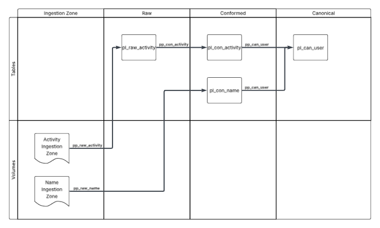

# Polta
_Data engineering tool combining Polars transformations with Delta tables/lakes._

 [](https://pypi.org/project/polta/)

# Core Concepts
The `polta` module revolves around the following core objects that, in conjunction with each other, allow you to create small-to-medium-scale pipelines.

Throughout this README and in the repository's `sample` pipelines, various objects are aliased in a consistent manner when imported. Below is a table of such aliases for convenience.

| Object             | Alias                              | Example           |
| ------------------ | ---------------------------------- | ----------------- |
| `PoltaTable`       | pt_<quality-prefix\>_<table-name\> | pt_raw_activity   |
| `PoltaExporter`    | ex_<quality-prefix\>_<table-name\> | ex_can_user       | 
| `PoltaIngester`    | in_<quality-prefix\>_<table-name\> | in_raw_activity   |
| `PoltaTransformer` | tr_<quality-prefix\>_<table-name\> | tr_con_user       |
| `PoltaPipe`        | pp_<quality-prefix\>_<table-name\> | pp_con_activity   |
| `PoltaPipeline`    | ppl_<domain\>_<table-name\>        | ppl_standard_user |

To illustrate, a `PoltaTable` is initially declared like this:

```python
# table.py
from polta.enums import TableQuality
from polta.table import PoltaTable


table: PoltaTable = PoltaTable(
  domain='standard',
  quality=TableQuality.RAW,
  name='test'
)
```

Then, whenever it is imported from another file, it is aliased like this:
```python
# other-file.py
from .table import table as pt_raw_test
```

The naming conventions are such for the following reasons:
1. It keeps initial declarations simple.
2. It allows importing multiple objects (e.g., `PoltaTable` and `PoltaPipe` objects) while avoiding variable collisions.
3. It adds consistent and descriptive identifiers to the objects throughout the codebase.

## PoltaMetastore

Every `polta` integration should have a dedicated metastore for preserving data and logs. This is automatically created and managed by `polta` before executing any transformations or reads.

There are two main aspects of a `PoltaMetastore`:

1. *Tables*: Contains every table across all layers.
2. *Volumes*: Contains file storage systems needed for transformations.

This structure is inspired by `deltalake` and follows similar metastore paradigms.

It loosely follows the modern [Medallion Architecture](https://www.databricks.com/glossary/medallion-architecture) language for organizing the data layers, with these naming conventions for each layer:

1. *Raw*: Source data, usually a payload string.
2. *Conformed*: Structured data.
3. *Canonical*: Business-level data.
4. *Export*: Cleaned, formatted export data.

If the data can be conformed easily, it may get loaded from the ingestion zone into _conformed_. Otherwise, it should get loaded into _raw_.

## PoltaTable

The `PoltaTable` is the primary way to read and write data.

It stores data using `deltalake`, and it transforms data using `polars`. Because it integrates two modules together, it has many fields and methods for communicating seamlessly to and fro. For example, every `PoltaTable` has readily available a `schema_polars` and `schema_deltalake` object that both represent your table schema.

Each raw `PoltaTable` has a dedicated ingestion zone located in the `PoltaMetastore` to store sources files ready to be loaded into the raw layer.

> In this repository, a `PoltaTable` alias is formatted as `pt_<quality-abbreviation>_<table-name>` (e.g., `pt_con_user`).

## PoltaPipe

The `PoltaPipe` is the primary way to transform data from one location to another in a new format.

Currently, there are three kinds of supported pipes, each described below.

> In this repository, a `PoltaPipe` alias is formatted as `pp_<quality-abbreviation>_<target-table-name>` (e.g., `pp_con_user`).

### PoltaIngester

The `PoltaIngester` is the primary way to load source files into the raw layer.

It currently supports ingesting these formats:

1. JSON
2. String payload

An instance can get passed into a `PoltaPipe` to ingest data into a `PoltaTable`.

> In this repository, a `PoltaIngester` alias is formatted as `in_<quality-abbreviation>_<table-name>` (e.g., `in_con_user`).

### PoltaTransformer

The `PoltaTransformer` reads one or more `PoltaTable` objects from a layer, applies transformation logic, and writes the output into a target `PoltaTable`.

> In this repository, a `PoltaTransformer` alias is formatted as `tr_<quality-abbreviation>_<table-name>` (e.g., `tr_con_user`).

### PoltaExporter

The `PoltaExporter` reads a `PoltaTable` and exports it in a desired format usually into an export directory within the `PoltaMetastore`.

It currently supports exporting these formats:
1. JSON
2. CSV

> In this repository, a `PoltaExporter` alias is formatted as `ex_<table-quality-abbreviation>_<table-name>` (e.g., `ex_can_user`).

## PoltaPipeline

The `PoltaPipeline` is the primary way to link `PoltaPipe` objects together to create a unified data pipeline.

It takes in a list of raw, conformed, canonical, and export `PoltaPipe` objects and executes them sequentially.

There are two kinds of pipelines you can build:

1. `Standard`: each step in the pipeline saves to `PoltaTable` objects in the metastore. During execution, pipes typically retrieve the current state of each of those `PoltaTable` objects and saves the output in the target `PoltaTable`. This allows a full end-to-end-pipeline that preserves all pipe outputs into the metastore for future usage.
2. `In Memory`: each step in the pipeline preserves the `DataFrames` across layers and loads them into each subsequent pipe. This allows a full end-to-end pipeline that can export the results without reling on preserving the intermediate data in the metastore. 

If you need to store each run over time, you should use a `Standard` pipeline. However, if you simply want to load a dataset, transform it, and export it into a format, just wanting to preserve that export, then you should use an `In Memory` pipeline. The `sample` directory contains pipelines for both kinds.

# Installation

## Installing to a Project
This project exists in `PyPI` and can be installed this way:

```sh
pip install polta
```

## Initializing the Repository

To use the code from the repository itself, either for testing or contributing, follow these steps:

1. Clone the repository to your local machine.
2. Create a virtual environment, preferably using `venv`, that runs `Python 3.13`. 
3. Ensure you have `poetry` installed (installation instructions [here](https://python-poetry.org/docs/#installation)).
4. Make `poetry` use the virtual environment using `poetry env use .venv/path/to/python`.
5. Download dependencies by executing `poetry install`.
6. Building a wheel file by executing `poetry build`.

# Testing

This project uses `pytest` for its tests, all of which exist in the `tests` directory. Below are recommended testing options.

### VS Code (Preferred)

There is a `Testing` tab in the left-most menu by default that allows you to run `pytest` tests in bulk or individually.

### Poetry
To execute tests using `poetry`, run this command in your terminal at the top-level directory:
```sh
poetry run pytest tests/ -vv -s
```

# Usage

Below are sample code snippets to show basic usage. For full sample pipelines, consult the `sample` directory in the repository. These tables, pipes, and pipeline get used in the integration test which is located in the `tests/integration/test_pipeline.py` pytest file.

Below is a diagram of the basic pipeline architecture with these features:

- The columns represent logical layers where data is stored.
- The rows represent the two kinds of data within the metastore.
- The pipes represent `PoltaPipe` objects.
- The rectangles represent `PoltaTable` objects.
- The rectangles with wavy bottom sides represent directories in the metastore with various files.



## Sample Metastore

The creation of a new metastore is simple. Below is a sample metastore that can be passed into the initialization of any `PoltaTable` to ensure the table writes to the metastore.

```python
from polta.metastore import PoltaMetastore


metastore: PoltaMetastore = PoltaMetastore('path/to/desired/store')
```

## Sample Ingester PoltaPipe

This sample code illustrates a simple raw ingestion pipe.

A pipe file typically contains a `PoltaTable` and a `PoltaPipe`, and a raw table might have an additional `PoltaIngester`.

```python
from deltalake import Field, Schema

from polta.enums import (
  DirectoryType,
  RawFileType,
  TableQuality
)
from polta.ingester import PoltaIngester
from polta.pipe import PoltaPipe
from polta.table import PoltaTable

from .metastore import metastore


table: PoltaTable = PoltaTable(
  domain='sample',
  quality=TableQuality.RAW,
  name='table',
  raw_schema=Schema([
    Field('payload', 'string')
  ]),
  metastore=metastore
)

ingester: PoltaIngester = PoltaIngester(
  table=table,
  directory_type=DirectoryType.SHALLOW,
  raw_file_type=RawFileType.JSON
)

pipe: PoltaPipe = PoltaPipe(ingester)
```

By making `table.raw_schema` a simple payload, that signals to the ingester that the transformation is a simple file read.

This code is all that is needed to execute a load of all data from the ingestion zone to a raw table. To do so, execute `pipe.execute()`.

If you want to read the data, execute `table.get()`.

## Sample Transformer PoltaPipe

For instances where transformation logic is required, you should use the `PoltaTransformer` class to transform data from one layer to another.

```python
from deltalake import Field, Schema
from polars import col, DataFrame
from polars.datatypes import DataType, List, Struct

from polta.enums import TableQuality, WriteLogic
from polta.maps import PoltaMaps
from polta.pipe import PoltaPipe
from polta.table import PoltaTable
from polta.transformer import PoltaTransformer
from polta.udfs import string_to_struct
from sample.standard.table import \
  table as pt_raw_table

from .metastore import metastore


table: PoltaTable = PoltaTable(
  domain='test',
  quality=TableQuality.CONFORMED,
  name='table',
  raw_schema=Schema([
    Field('id', 'string'),
    Field('active_ind', 'boolean')
  ]),
  metastore=metastore
)

def get_dfs() -> dict[str, DataFrame]:
  """Basic load logic:
    1. Get raw table data as a DataFrame
    2. Anti join against conformed layer to get net-new records
  
  Returns:
    dfs (dict[str, DataFrame]): The resulting data as 'table'
  """
  conformed_ids: DataFrame = table.get(select=['_raw_id'], unique=True)
  df: DataFrame = (pt_raw_table
    .get()
    .join(conformed_ids, '_raw_id', 'anti')
  )
  return {'table': df}

def transform(dfs: dict[str, DataFrame]) -> DataFrame:
  """Basic transformation logic:
    1. Retrieve the raw table DataFrame
    2. Convert 'payload' into a struct
    3. Explode the struct
    4. Convert the struct key-value pairs into column-cell values

  Returns:
    df (DataFrame): the resulting DataFrame
  """
  df: DataFrame = dfs['table']
  raw_polars_schema: dict[str, DataType] = PoltaMaps \
      .deltalake_schema_to_polars_schema(table.raw_schema)

  return (df
    .with_columns([
      col('payload')
        .map_elements(string_to_struct, return_dtype=List(Struct(raw_polars_schema)))
    ])
    .explode('payload')
    .with_columns([
      col('payload').struct.field(f).alias(f)
      for f in [n.name for n in table.raw_schema.fields]
    ])
    .drop('payload')
  )

transformer: PoltaTransformer = PoltaTransformer(
  table=table,
  load_logic=get_dfs,
  transform_logic=transform,
  write_logic=WriteLogic.APPEND
)

pipe: PoltaPipe = PoltaPipe(transformer)
```

This `PoltaTransformer` instance receives the raw data from the previous example, explodes the data, and extracts the proper fields into a proper conformed DataFrame.

This one file contains every object in a modular format, which means you can import in another file any part of the pipe as needed.

> This modular design also allows you to create integration and unit tests around your `load_logic` and `transform_logic` easily, as illustrated in the `tests/` directory.

You can execute the `PoltaPipe` by running `pipe.execute()` wherever you want, and any new raw files will get transformed and loaded into the conformed layer.

## Sample PoltaPipeline

To connect the above pipes together, you can create a `PoltaPipeline`, as sampled below.

```python
from polta.pipeline import PoltaPipeline

from sample.standard.raw.table import \
  pipe as pp_raw_sample
from sample.standard.conformed.table import \
  pipe as pp_con_sample


pipeline: PoltaPipeline = PoltaPipeline(
  raw_pipes=[pp_raw_sample],
  conformed_pipes=[pp_con_sample]
)
```

You can then execute your pipeline by running `pipeline.execute()`.

# License

This project exists under the `MIT License`.

## Acknowledgements

The `polta` project uses third-party dependencies that use the following permissive open-source licenses:

1. `Apache Software License (Apache-2.0)`
2. `BSD-3-Clause License`
3. `MIT License`

Below are the top-level packages with their licenses.

| Package | Version | Purpose | License |
| ------- | ------- | ------- | ------- |
| [deltalake](https://github.com/delta-io/delta-rs) | 0.25.5 | Stores and reads data | Apache Software License (Apache-2.0) |
| [ipykernel](https://github.com/ipython/ipykernel) | 6.29.5 | Creates Jupyter notebooks for ad hoc analytics | BSD-3-Clause License |
| [polars](https://github.com/pola-rs/polars) | 1.30.0 | Executes DataFrame transformation | MIT License |
| [pytest](https://github.com/pytest-dev/pytest) | 8.3.5 | Runs test cases for unit/integration testing | MIT License |
| [tzdata](https://github.com/python/tzdata) | 2025.2 | Contains timezone information for Datetime objects | Apache Software License (Apache-2.0) |

# Contributing

Because this project is open-source, contributions are most welcome.

To contribute, follow these steps:

1. Clone the repository into your local machine.
2. Create a descriptive feature branch.
3. Make the desired changes.
4. Fully test the desired changes using the `unit` and `integration` test directories in the `tests` directory.
5. Uptick the `poetry` project version appropriately using standard semantic versioning.
6. Create a merge request into the `main` branch of the official `polta` project and assign it initially to @JoshTG.
7. Once the merge request is approved and merged, an administrator will schedule a release cycle and deploy the changes using a new release tag.

# Contact

You may contact the main contributor, @JoshTG, by sending an email to this address: jgillilanddata@gmail.com
